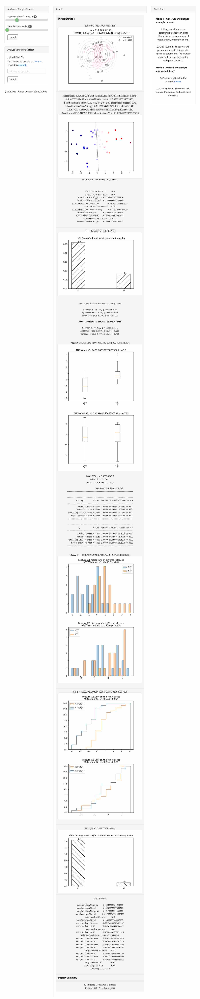

# cla (classifiability analysis)

A unified classifiability analysis framework based on meta-learner and its application in spectroscopic profiling data [J]. Applied Intelligence, 2021, doi: 10.1007/s10489-021-02810-8

pyCLAMs: An integrated Python toolkit for classifiability analysis [J]. SoftwareX, Volume 18, June 2022, 101007, doi: 10.1016/j.softx.2022.101007 

# Warning

Since 0.3.x, we have reorganized the package structure. Any upper app should be revised accordingly.  
Since 1.0.0, we stopped pyCLAMs and switch to cla.  

# Installation 

pip install cla (pyCLAMs for versions under 1.0.0)  
pip install rpy2  
Install the R runtime and the ECol library (https://github.com/lpfgarcia/ECoL).  

  Run 'install.packages("ECoL")' in R. It will take very long time. You must wait for the installation to complete.     
  Sometimes, you may want to change the CRAN mirror. Under the "Packages" menu, click "Set CRAN Mirror".    
  After installation, you can check by R command 'installed.packages()'. 

# How to use 

Download the sample dataset from the /data folder
Use the following sample code to use the package:

<pre>
  # import clams # (for versions < 1.0.0)  
  from cla import metrics # (for versions > 1.0.0)  

  # load the dataset or generate a toy dataset by X,y = mvg(md = 2)
  df = pd.read_csv('sample.csv')
  X = np.array(df.iloc[:,:-1]) # skip first and last cols
  y = np.array(df.iloc[:,-1])

  # get all metrics
  metrics.get_metrics(X,y) # Return a dictionary of all metrics

  # get metrics as JSON
  metrics.get_json(X,y)

  # get an html report and display in Jupyter notebook
  from IPython.display import display, HTML
  display(HTML(metrics.get_html(X,y)))
</pre>

# Start the web GUI  

  1. python -m cla.gui.run
  2. Open http://localhost:5005/ in your browser. 
  
  3. A ready-to-use online demo is http://spacs.brahma.pub/research/CLA

 

# Metrics and functions added since the original publication

## 1. metrics

  classification.Mean_KLD - mean KLD (Kullback-Leibler divergence) between ground truth and predicted one-hot encodings  
  correlation.r2 - R2, the R-squared effect size  
  test.CHISQ, test.CHISQ.log10, test.CHISQ.CHI2 - Chi-squared test  
  classification.McNemar, classification.McNemar.CHI2 - McNemar test on the groud-truth and classifier's prediction     
  classification.SVM.Margin - the linear-SVC's margin width  
  test.student, test.student.min, test.student.min.log10, test.student.T, test.student.T.max  
  test.KW, test.KW.min, test.KW.min.log10, test.KW.H, test.KW.H.max  
  test.Median, test.Median.min, test.Median.min.log10, test.Median.CHI2, test.Median.CHI2.max  

## 2. refactor

  Integrate some existing packages and reorganize the package structure.   

  <table>
      <tbody>
          <tr>
              <td>module</td>
              <td>sub-module</td>
              <td>description</td>
              <td>standalone pypi package (if any)</td>
              <td>publication</td>
          </tr>
          <tr>
              <td rowspan=4>cla</td>
              <td>cla.metrics</td>
              <td>Provides various classifiability analysis metrics.</td>
              <td>pyCLAMs</td>
              <td>pyCLAMs: An integrated Python toolkit for classifiability analysis [J]. SoftwareX, Volume 18, June 2022, 101007, doi: 10.1016/j.softx.2022.101007 </td>
          </tr>
          <tr>
              <td>cla.unify</td>
              <td>Provide a method for unifying multiple atom metrics.</td>
              <td>N/A</td>
              <td>A unified classifiability analysis framework based on meta-learner and its application in spectroscopic profiling data [J]. Applied Intelligence, 2021, doi: 10.1007/s10489-021-02810-8</td>
          </tr>
          <tr>
              <td>cla.vis</td>
              <td>Data visualization and plotting functions.</td>
              <td>N/A</td>
              <td>N/A</td>
          </tr> 
          <tr>
              <td>cla.gui</td>
              <td>Provide a user-friendly GUI.</td>
              <td>wCLAMs</td>
              <td>N/A</td>
          </tr>        
      </tbody>
  </table>
